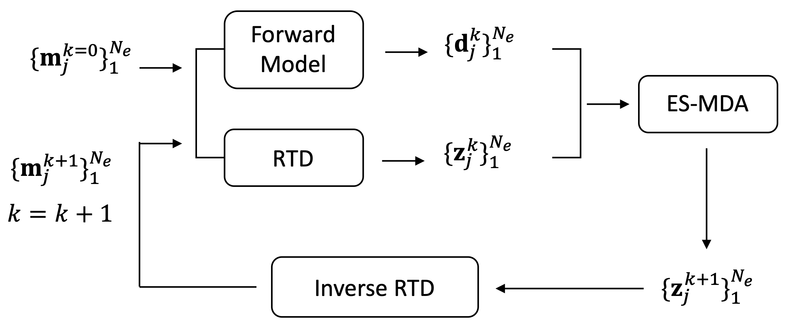

# ES-RTD-FDEM
This repo provides code and synthetic data for our paper <b>Frequency-domain electromagnetic induction for the prediction of electrical conductivity and magnetic susceptibility using geostatistical inversion and randomized tensor decomposition</b>.

 <b>The overall workflow of ES-RTD-FDEM</b> 

 
